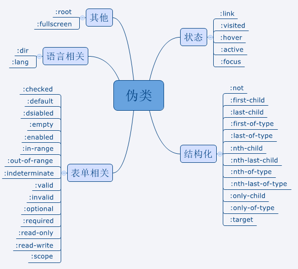

## 一面（感觉是组员要不就是组长）
### 1. 基本类型
String、Number、Boolean、Null、Undefined、Symbol、BigInt、Object:{Array,Function}

### 2. 数组方法
push、pop、unshift、shift、reduce、splice、slice、concat、from、map、join、reverse、indexOf、includes、forEach。

### 3. splice和slice区别
splice改变原始数组，slice返回新数组。

### 4. flex属性都有哪些
<https://blog.csdn.net/qwe435541908/article/details/104518217>

### 5. css选择器有哪些？
1. 简单选择器
2. 属性选择器
3. 组合选择器
4. 伪类
5. 伪元素
6. 多重选择器

<https://www.jianshu.com/p/1d203a7bb768>

### 6. 伪类和伪元素区别？
- 伪类和伪元素都是用来表示文档树以外的"元素"。
- 伪类和伪元素分别用单冒号:和双冒号::来表示。
- 伪类和伪元素的区别，最关键的点在于如果没有伪元素(或伪类)，是否需要添加元素才能达到目的，如果是则是伪元素，反之则是伪类。  

   


### 7. align-items和align-content区别是什么
align-items /* flex-start | flex-end | center | baseline | stretch */
align-content /* flex-start | flex-end | center | space-between | space-around | stretch */

`align-items`和`align-content`有相同的功能，不过不同点是它是用来让每一个单行的容器居中而不是让整个容器居中。    
   
   

<https://blog.csdn.net/sinat_27088253/article/details/51532992>

### 8. push和pop后返回值是什么。
push返回添加后的数组长度，pop返回删除的元素。

### 9. 深拷贝和浅拷贝
浅拷贝是地址引用，修改对象中的对象或者数组会影响原始对象。  
深拷贝是内存拷贝，修改对象中的所有值不会影响原始对象。

### 10. 要深拷贝一个对象怎么做？
深拷贝要考虑对象类型、数组类型、普通值的情况。

### 11. 字符串转数字几种方法，分别对'12a'处理得到的返回值
parseInt,parseFloat,Number,-0
```js
parseInt('12a')//12
parseFloat('12a')//12
Number('12a')//NaN
'12a'-0//NaN
```

## 12. Number(2)返回的是什么。
Number() 函数把对象的值转换为数字。如果对象的值无法转换为数字，那么 Number() 函数返回 NaN。
```js
Number(2)//2
Number('2a')//NaN
typeof Number(2)==='number'//true

new Number(2)//Number {2}
new Number('2a')//Number {NaN}
typeof (new Number(2))==='object'//true
```

### 13. https和http区别
比http更安全，多了一层SSL/TLS协议。它的作用是：   
1. 加密HTTP的通信内容（混合加密（非对称和对称加密都涉及））
2. 服务端给客户端发送证书验证了服务端的身份（服务器需要确认客户端的身份，就会再包含一项请求，要求客户端提供"客户端证书"）
3. 保证了数据的完整性（对通信做了加密）

### 14. vue中生命周期beforeMount和mounted理解
`beforeMount`是在挂载前执行，执行了render函数返回虚拟DOM，然后递归虚拟DOM创建了一个完整的 DOM 树并插入到 Body 上。  
`mounted`DOM已完成挂载，可以访问DOM元素节点了。

### 15. Set-Cookie中的HttpOnly作用？
设置了 HttpOnly 属性的 cookie 不能使用 JavaScript 经由  Document.cookie 属性、XMLHttpRequest 和  Request APIs 进行访问，以防范跨站脚本攻击（XSS）。

### 16. Cookie、sessionStorage、localStorage 
这三个都是本地存储，Cookie可以存放的值有4k左右，主要是存放服务端Set-Cookies的数据，和session完成状态的保存。  
存储在 localStorage 的数据可以长期保留；  
存储在 sessionStorage 里面的数据在页面会话结束时会被清除。
页面会话在浏览器打开期间一直保持，并且重新加载或恢复页面仍会保持原来的页面会话。
在新标签或窗口打开一个页面时会复制顶级浏览会话的上下文作为新会话的上下文，这点和 session cookies 的运行方式不同。
打开多个相同的URL的Tabs页面，会创建各自的sessionStorage。
关闭对应浏览器tab，会清除对应的sessionStorage。

### 17. 数组排序
先排序一个数字数组要求从大到小。我用快排做出来了，然后又要求排序下列数字和字母混合数组，还是从大到小排序，数字在字母前面。禁止使用sort()，禁止直接比较字符串大小。
```js
function numSort(arr) {
  if (arr.length < 2) {
    return arr
  }
  let left = [];
  let right = [];
  let base = arr[0];
  for (let i = 1;i < arr.length;i++) {
    if (arr[i] > base) {
      left.push(arr[i]);
    } else {
      right.push(arr[i]);
    }
  }
  return numSort(left).concat([base],numSort(right));
}
function strSort(arr) {
  if (arr.length < 2) {
    return arr
  }
  let left = [];
  let right = [];
  let base = arr[0];
  for (let i = 1;i < arr.length;i++) {
    let index = 0;
    let flag = true;
    while (index < arr[i].length && index < base.length) {
      if (arr[i].charCodeAt(index) == base.charCodeAt(index)) {
        index++;
      } else if (arr[i].charCodeAt(index) > base.charCodeAt(index)) {
        left.push(arr[i]);
        flag = false;
        break;
      } else {
        right.push(arr[i]);
        flag = false;
        break;
      }
    }
    if (flag) {
      if (arr[i] == base) {
        right.push(arr[i]);
      } else if (arr[i].length > base.length) {
        left.push(arr[i]);
      } else {
        right.push(arr[i]);
      }
    }
  }
  return strSort(left).concat([base],strSort(right));
}
function csort(arr) {
  let num = [];
  let str = []
  for (let i = 0;i < arr.length;i++) {
    if (typeof arr[i] == 'number') {
      num.push(arr[i])
    } else {
      str.push(arr[i]);
    }
  }
  let numSortArr = numSort(num);
  let strSortArr = strSort(str);
  return numSortArr.concat(strSortArr);
}
function main () {
	console.log(csort([21, 'zone', 43, 'forever', 11, 'forrest', 33, 'zoo','zoor', 'peak', 55, 'peer']));
}
main();//[ 55,43,33,21,11,'zoor','zoo','zone','peer','peak','forrest','forever' ]
```

## 二面技术面（感觉是组长或者技术负责人吧）
### 1. 冒泡排序
```js
function sort(arr){
  for(let i=1;i<arr.length;i++){
    for(let j=0;j<arr.length-i;j++){
      if(arr[j+1]<arr[j]){
        [arr[j],arr[j+1]]=[arr[j+1],arr[j]];
      }
    }
  }
  return arr;
}
console.log(sort([5,4,6,2,2,1]))
```
### 2. Promise封装ajax
```js
function get(url) {
  return new Promise((resolve,reject)=>{
    let xhr = new XMLHttpRequest();
    xhr.open('get',url,true);
    xhr.send();
    xhr.onreadystatechange = function() {
      if (xhr.readyState === 4) {
        if ( xhr.status >= 200 && xhr.status <= 400) {
            resolve(xhr.responseText);//执行成功函数
        } else if (xhr.status >= 400) {
            reject(xhr.response);//执行失败函数
        }
      }
    }
    //xhr.readyState
    // 0	UNSENT	代理被创建，但尚未调用 open() 方法。
    // 1	OPENED	open() 方法已经被调用。
    // 2	HEADERS_RECEIVED	send() 方法已经被调用，并且头部和状态已经可获得。
    // 3	LOADING	下载中； responseText 属性已经包含部分数据。
    // 4	DONE	下载操作已完成。
  })
}
```
### 3. vue中watch和computed理解
watch是用来监听数据变化的，computed是计算属性，依赖的数据改变它会自动重新计算，没有改变就不会再次计算。

### 4. vue中对象实现双向绑定
利用`Object.defineProperty`对数据设置setter和getter实现双向绑定。如果是对象或者数组就递归执行。然后如果是数组的话对一些操作进行重写。

### 5. 仿照vue中对数组push进行重写
```js
let temp=Array.prototype.push;
Array.prototype.push=function(...args){
  let res=temp.apply(this,args);
  console.log(1)
  return res;
}
let a=[1];
a.push(2,3,4)
```

### 6. css实现缩略图
设置`object-fit: cover`
```
.box { width: 160px; height: 160px; }
img { width: 100%; height: 100%; }
.cover { object-fit: cover; }
<div class="box">
    
</div>
```
<https://www.zhangxinxu.com/wordpress/2015/03/css3-object-position-object-fit/>
<https://www.zhangxinxu.com/study/201503/css3-object-fit.html>

### 7. https理解
比http更安全，多了一层SSL/TLS协议。它的作用是：   
1. 加密HTTP的通信内容（混合加密（非对称和对称加密都涉及））
2. 服务端给客户端发送证书验证了服务端的身份（服务器需要确认客户端的身份，就会再包含一项请求，要求客户端提供"客户端证书"）
3. 保证了数据的完整性（对通信做了加密）

### 8. https加密方式
混合加密（在传输共享密钥时进行非对称加密，传输数据时进行对称加密）

### 9. https有没有可能还被攻击
有可能，http改成https后，收藏夹中地址还是原来的，以前的地址要就要重定向到新地址，这个过程可能会被攻击者利用。

### 10. url重定向攻击解决方法
安全隐患的产生原因：    
- 重定向的目标URL能够由外界指定。   
- 没有对重定向的目标域名进行校验。  
以上两点是AND条件，也就是说只有同时满足这两点时才会形成自由重定向漏洞，因此，只要使其中一项无法满足，也就消除了安全隐患。   

解决对策：    
- 固定重定向的目标URL
- 使用编号指定重定向的目标URL
- 校验重定向的目标域名。采用白名单机制，将重定向目标限定在允许的域名范围内。

<https://cshihong.github.io/2019/09/21/%E9%87%8D%E5%AE%9A%E5%90%91%E7%9B%B8%E5%85%B3%E7%9A%84%E5%AE%89%E5%85%A8%E9%9A%90%E6%82%A3/>

### 11. xss如何预防
1. 对输入值以下字符进行转义`& < > " ' /`
2. 利用XSS漏洞扫描工具进行扫描。

### 12. csrf如何预防
1. CSRF自动防御策略：同源检测（Origin 和 Referer 验证）。
2. 服务端对`Set-Cookie`设置`SameSite`属性为设置为以下属性：  
  `Strict`：最为严格，完全禁止第三方 Cookie，跨站点时，任何情况下都不会发送 Cookie。  
  `Lax`：Lax规则稍稍放宽，大多数情况也是不发送第三方 Cookie，但是导航到目标网址的 Get 请求除外。  
3. CSRF主动防御措施：Token验证（利用了CSRF无法获取到Cookie信息) 或者 双重Cookie验证(两个sessionid，请求时将一个拼接到url后面，后台比较url参数和另一个session是否相等，利用了CSRF无法获取到Cookie信息) 以及配合Samesite Cookie。