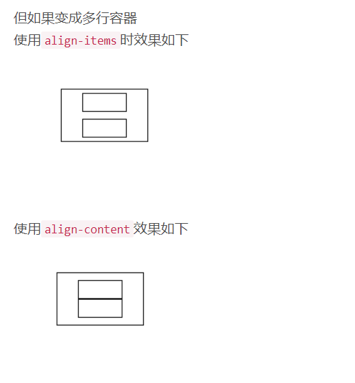
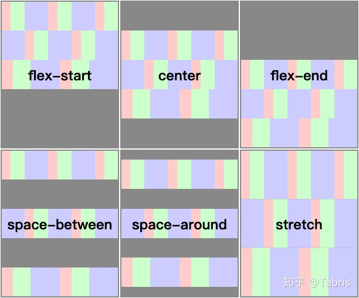

## 一面（60分钟）
### 1. 基本类型
String、Number、Boolean、Null、Undefined、Symbol、BigInt、Object:{Array,Function}

### 2. 你知道的数组方法
push、pop、unshift、shift、reduce、splice、slice、concat、from、map、join、reverse、indexOf、includes、forEach。

### 3. splice和slice区别
splice改变原始数组，slice返回新数组。

### 4. flex属性都有哪些
<https://blog.csdn.net/qwe435541908/article/details/104518217>

### 5. css选择器有哪些？
1. 简单选择器
2. 属性选择器
3. 组合选择器
4. 伪类
5. 伪元素
6. 多重选择器

<https://www.jianshu.com/p/1d203a7bb768>

### 6. 伪类和伪元素区别？
- 伪类和伪元素都是用来表示文档树以外的"元素"。
- 伪类和伪元素分别用单冒号:和双冒号::来表示。
- 伪类和伪元素的区别，最关键的点在于如果没有伪元素(或伪类)，是否需要添加元素才能达到目的，如果是则是伪元素，反之则是伪类。  

   


### 7. align-items和align-content区别是什么
```css
align-items /* flex-start | flex-end | center | baseline | stretch */
align-content /* flex-start | flex-end | center | space-between | space-around | stretch */
```

`align-items`和`align-content`有相同的功能，不过不同点是它是用来让每一个单行的容器居中而不是让整个容器居中。    
   
   

<https://blog.csdn.net/sinat_27088253/article/details/51532992>

### 8. push和pop后返回值是什么。
push返回添加后的数组长度，pop返回删除的元素。

### 9. 深拷贝和浅拷贝
浅拷贝是地址引用，修改对象中的对象或者数组会影响原始对象。  
深拷贝是内存拷贝，修改对象中的所有值不会影响原始对象。

### 10. 要深拷贝一个对象怎么做？
深拷贝要考虑对象类型、数组类型、普通值的情况。

### 11. 字符串转数字几种方法，分别对'12a'处理得到的返回值
parseInt,parseFloat,Number,-0
```js
parseInt('12a')//12
parseFloat('12a')//12
Number('12a')//NaN
'12a'-0//NaN
```

## 12. Number(2)返回的是什么。
Number() 函数把对象的值转换为数字。如果对象的值无法转换为数字，那么 Number() 函数返回 NaN。
```js
Number(2)//2
Number('2a')//NaN
typeof Number(2)==='number'//true

new Number(2)//Number {2}
new Number('2a')//Number {NaN}
typeof (new Number(2))==='object'//true
```

### 13. https和http区别
比http更安全，多了一层SSL/TLS协议。它的作用是：   
1. 加密HTTP的通信内容（混合加密（非对称和对称加密都涉及））
2. 服务端给客户端发送证书验证了服务端的身份（服务器需要确认客户端的身份，就会再包含一项请求，要求客户端提供"客户端证书"）
3. 保证了数据的完整性（对通信做了加密）

### 14. vue中生命周期beforeMount和mounted理解
`beforeMount`是在挂载前执行，执行了render函数返回虚拟DOM，然后递归虚拟DOM创建了一个完整的 DOM 树并插入到 Body 上。  
`mounted`DOM已完成挂载，可以访问DOM元素节点了。

### 15. Set-Cookie中的HttpOnly作用？
设置了 HttpOnly 属性的 cookie 不能使用 JavaScript 经由  Document.cookie 属性、XMLHttpRequest 和  Request APIs 进行访问，以防范跨站脚本攻击（XSS）。

### 16. Cookie、sessionStorage、localStorage 
这三个都是本地存储，Cookie可以存放的值有4k左右，主要是存放服务端Set-Cookies的数据，和session完成状态的保存。  
存储在 localStorage 的数据可以长期保留；  
存储在 sessionStorage 里面的数据在页面会话结束时会被清除。
页面会话在浏览器打开期间一直保持，并且重新加载或恢复页面仍会保持原来的页面会话。
在新标签或窗口打开一个页面时会复制顶级浏览会话的上下文作为新会话的上下文，这点和 session cookies 的运行方式不同。
打开多个相同的URL的Tabs页面，会创建各自的sessionStorage。
关闭对应浏览器tab，会清除对应的sessionStorage。

### 17. cache-control的no-store和no-cache区别？
no-cache：不使用本地缓存。需要使用协商缓存，先与服务器确认返回的响应是否被更改，如果之前的响应中存在ETag，那么请求的时候会与服务端验证，如果资源未被更改，则可以避免重新下载。

no-store：直接禁止游览器缓存数据，每次用户请求该资源，都会向服务器发送一个请求，每次都会下载完整的资源。

### 18. 数组排序（附加题）
先排序一个数字数组要求从大到小。我用快排做出来了，然后又要求排序下列数字和字母混合数组，还是从大到小排序，数字在字母前面。禁止使用sort()，禁止直接比较字符串大小。
```js
function numSort(arr) {
  if (arr.length < 2) {
    return arr
  }
  let left = [];
  let right = [];
  let base = arr[0];
  for (let i = 1;i < arr.length;i++) {
    if (arr[i] > base) {
      left.push(arr[i]);
    } else {
      right.push(arr[i]);
    }
  }
  return numSort(left).concat([base],numSort(right));
}
function strSort(arr) {
  if (arr.length < 2) {
    return arr
  }
  let left = [];
  let right = [];
  let base = arr[0];
  for (let i = 1;i < arr.length;i++) {
    let index = 0;
    let flag = true;
    while (index < arr[i].length && index < base.length) {
      if (arr[i].charCodeAt(index) == base.charCodeAt(index)) {
        index++;
      } else if (arr[i].charCodeAt(index) > base.charCodeAt(index)) {
        left.push(arr[i]);
        flag = false;
        break;
      } else {
        right.push(arr[i]);
        flag = false;
        break;
      }
    }
    if (flag) {
      if (arr[i] == base) {
        right.push(arr[i]);
      } else if (arr[i].length > base.length) {
        left.push(arr[i]);
      } else {
        right.push(arr[i]);
      }
    }
  }
  return strSort(left).concat([base],strSort(right));
}
function csort(arr) {
  let num = [];
  let str = []
  for (let i = 0;i < arr.length;i++) {
    if (typeof arr[i] == 'number') {
      num.push(arr[i])
    } else {
      str.push(arr[i]);
    }
  }
  let numSortArr = numSort(num);
  let strSortArr = strSort(str);
  return numSortArr.concat(strSortArr);
}
function main () {
	console.log(csort([21, 'zone', 43, 'forever', 11, 'forrest', 33, 'zoo','zoor', 'peak', 55, 'peer']));
}
main();//[ 55,43,33,21,11,'zoor','zoo','zone','peer','peak','forrest','forever' ]
```

## 二面技术面（40~50分钟）
### 1. 冒泡排序
```js
function sort(arr){
  for(let i=1;i<arr.length;i++){
    for(let j=0;j<arr.length-i;j++){
      if(arr[j+1]<arr[j]){
        [arr[j],arr[j+1]]=[arr[j+1],arr[j]];
      }
    }
  }
  return arr;
}
console.log(sort([5,4,6,2,2,1]))
```
### 2. Promise封装ajax
```js
function get(url) {
  return new Promise((resolve,reject)=>{
    let xhr = new XMLHttpRequest();
    xhr.open('get',url,true);
    xhr.send();
    xhr.onreadystatechange = function() {
      if (xhr.readyState === 4) {
        if ( xhr.status >= 200 && xhr.status <= 400) {
            resolve(xhr.responseText);//执行成功函数
        } else if (xhr.status >= 400) {
            reject(xhr.response);//执行失败函数
        }
      }
    }
    //xhr.readyState
    // 0	UNSENT	代理被创建，但尚未调用 open() 方法。
    // 1	OPENED	open() 方法已经被调用。
    // 2	HEADERS_RECEIVED	send() 方法已经被调用，并且头部和状态已经可获得。
    // 3	LOADING	下载中； responseText 属性已经包含部分数据。
    // 4	DONE	下载操作已完成。
  })
}
```
### 3. vue中watch和computed理解
watch是用来监听数据变化的，computed是计算属性，依赖的数据改变它会自动重新计算，没有改变就不会再次计算。

### 4. vue中对象实现双向绑定
利用`Object.defineProperty`对数据设置setter和getter实现双向绑定。如果是对象或者数组就递归执行。然后如果是数组的话对一些操作进行重写。

### 5. 仿照vue中对数组push进行重写
```js
let temp=Array.prototype.push;
Array.prototype.push=function(...args){
  let res=temp.apply(this,args);
  console.log(1)
  return res;
}
let a=[1];
a.push(2,3,4)
```

### 6. 说下vuex的使用
照着下面这个图把工作流程说出来就差不多了。

### 7. css实现缩略图
设置`object-fit: cover`
```
.box { width: 160px; height: 160px; }
img { width: 100%; height: 100%; }
.cover { object-fit: cover; }
<div class="box">
    
</div>
```
<https://www.zhangxinxu.com/wordpress/2015/03/css3-object-position-object-fit/>
<https://www.zhangxinxu.com/study/201503/css3-object-fit.html>

### 8. https理解
比http更安全，多了一层SSL/TLS协议。它的作用是：   
1. 加密HTTP的通信内容（混合加密（非对称和对称加密都涉及））
2. 服务端给客户端发送证书验证了服务端的身份（服务器需要确认客户端的身份，就会再包含一项请求，要求客户端提供"客户端证书"）
3. 保证了数据的完整性（对通信做了加密）

### 9. https加密方式
混合加密（在传输共享密钥时进行非对称加密，传输数据时进行对称加密）

### 10. https有没有可能还被攻击
有可能，http改成https后，收藏夹中地址还是原来的，以前的地址要就要重定向到新地址，这个过程可能会被攻击者利用，修改重定向的地址。

### 11. url重定向攻击解决方法
安全隐患的产生原因：    
- 重定向的目标URL能够由外界指定。   
- 没有对重定向的目标域名进行校验。  
以上两点是AND条件，也就是说只有同时满足这两点时才会形成自由重定向漏洞，因此，只要使其中一项无法满足，也就消除了安全隐患。   

解决对策：    
- 固定重定向的目标URL
- 使用编号指定重定向的目标URL
- 校验重定向的目标域名。采用白名单机制，将重定向目标限定在允许的域名范围内。

<https://cshihong.github.io/2019/09/21/%E9%87%8D%E5%AE%9A%E5%90%91%E7%9B%B8%E5%85%B3%E7%9A%84%E5%AE%89%E5%85%A8%E9%9A%90%E6%82%A3/>

### 12. xss如何预防
1. 对输入值以下字符进行转义`& < > " ' /`
2. 利用XSS漏洞扫描工具进行扫描。

### 13. csrf如何预防
1. CSRF自动防御策略：同源检测（Origin 和 Referer 验证）。
2. 服务端对`Set-Cookie`设置`SameSite`属性为设置为以下属性：  
  `Strict`：最为严格，完全禁止第三方 Cookie，跨站点时，任何情况下都不会发送 Cookie。  
  `Lax`：Lax规则稍稍放宽，大多数情况也是不发送第三方 Cookie，但是导航到目标网址的 Get 请求除外。  
3. CSRF主动防御措施：Token验证（利用了CSRF无法获取到Cookie信息) 或者 双重Cookie验证(两个sessionid，请求时将一个拼接到url后面，后台比较url参数和另一个session是否相等，利用了CSRF无法获取到Cookie信息) 以及配合Samesite Cookie。

### 14. token是什么？
<https://blog.csdn.net/Jason_Fangh/article/details/55113627>

### 15. 有啥想问的？
技术栈，协作方式等

## 三面技术面（30~40分钟）
### 1. 从技术方向介绍下项目
### 2. 看你项目中有流程模块，具体怎么做的，是动态生成流程还是静态生成流程？
### 3. 动态生成表单字段是怎么和后台交互的？
### 4. css方面如何优化性能？
减少css表达式的使用。   
<https://juejin.im/post/6844903649605320711#heading-7>

### 5. 性能优化？
从代码编写方式，打包工具优化，http方面介绍。

### 6. 页面是如何渲染的
服务器返回html页面数据后，html部分解析为DOM树，css解析为css对象模型，DOM树和css对象模型结合生成render树，最后进过回流和重绘显示页面。

### 7. http缓存说下
强缓存（Expires、Cache-Control）和协商缓存（ETag/If-None-Match、Last-Modified/If-Modify-Since）。

### 8. 说下cookie、session、localstorage、sessionstorage区别？
一面已经说了。

### 9. 接触过xss和csrf攻击吗？
因为是toB企业所以这两个接触的比较少，只是接触过xss。然后说了下xss攻击和如何预防的。

### 10. 有什么想问的
问了下业务方面的问题，还有人员配置。

### 11. 最后问了下我的基本情况（期望、到岗时间等）

## hr面

## 总结
先来自我总结下，整个流程是通过腾讯视频会议来进行的。问的技术包括（按照频率来排序）js、http、vue、css，还有一些软知识。我一二面是一下午进行完的，三面中间隔了大概一天，

前三面都是技术面，一面非常注重基础问的深度不是很深，二面个人感觉最难，有深度，三面主要是从你项目询问一些问题来看岗位匹配度，还有遇到一些问题如何解决（技术广度）。自我感觉一二面前几个问题非常基础，就是如果答不出来就gg那种。三面感觉主要是是从你项目看这个岗位的匹配程度。前三面应该是面试官级别递增的。下来详细说下这三面。

一面：感觉主要考察js基础和css基础。自我感觉答的良好，面完感觉100%能过的那种。问的非常基础，问的大部分是js用法理解之类的，然后是css类的问题，然后问了少量的http，vue就问了一两道。基本每个问题都答出来了，大概一两道题有点小问题。最后有一道算法排序笔试题，属于如果有时间就做没时间就算了，感觉是到加分题。开始看错了以为从小到大排序，最后改了下用快排递归做了出来。做出来后把题又变了下，但是由于二面时间马上到了，所以就口头说了下方法，没具体做出来。

二面：感觉主要考察手写代码能力和技术深度行不行，就算不会也要把代码写出来。自我感觉答得一般，面完后感觉60%过的那种。大部分都是笔试题，一上来看一面最后有道排序题，就让我写了冒泡排序，这个题感觉是写不出来就gg的题。然后就是问一些问题，答出了然后让你手写相关代码。

三面：感觉主要通过你的项目和应聘的岗位常见问题考察你的岗位匹配度。自我感觉良吧，面完感觉80%能过。主要是通过介绍项目来解决面试官出的一些问题，然后问了一些性能优化，http之类的。最后交流了下双方的基本情况。

hr面：

总体来说，我感觉我css和技术广度方面（脑洞不够大）还是有待加强。

## 我给你的建议
### 投递简历
首先你投递简历前就应该知道你需要应聘什么岗位，最好找应聘要求和你现在岗位技术栈和项目相匹配的，这样就会提高简历和面试的通过率，不要海投。

### 简历通过后
这个时候应该尽量通过应聘要求和百度谷歌去了解应聘岗位的业务，找这些业务和你现在业务的共同点，这个也很重要，以及总结下这些业务难点和解决方法。这个也许就会在问你项目的时候问到，因为面试官看你简历的同时也是在寻找岗位匹配度在哪，面试官级别越高被问到的几率越大。最后他会根据这些相同的业务向你提一些问题让你解答。看你是不是具备解决岗位上的一些问题，从而看你和岗位匹配不。所以这个也很重要。

### 面试时
首先是答题方式，最好按照**总分总的方式来答**，这样有利于你的理解和逻辑表达。面试官也会容易理解你说的话。  

遇到不理解的题，一定不要不说话也不要随便说，应该先向面试官**口述你的理解**，然后把你不理解的地方讲出来，他再次复述后，你再次向他复述，来询问你理解的有问题没。一般来说你如果向面试官口述不理解的地方，他会详细的说他需要你干啥。

如果理解思考后只知道一些相关的知识点，那么就向面试官把你知道的叙述出来，**不会的直接说这个不是很清楚**。（这个很重要，因为拖得时间越长就越影响你的发挥，你整个面试就感觉面试官只问你这个题）

### 面试管想要什么？
最后一定要搞清楚面试管想要什么？面试通过并不是要把所有题都答上来，而是你要让面试官看到你的思考你的理解，还要在交流中让面试官认识到你和岗位很匹配，足够谦虚，这就够了。