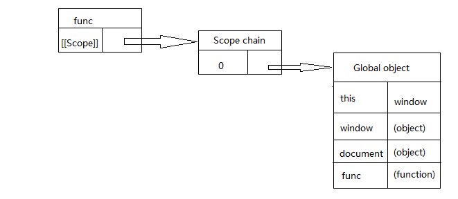
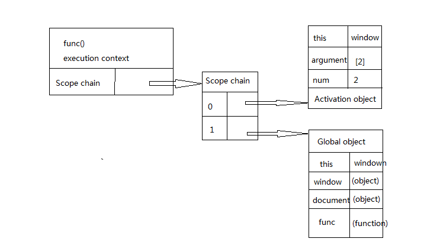

1. 作用域链
函数内部属性[[Scope]]包含了一个函数被创建的作用域中对象的集合。这个集合被称为函数的作用域链，它决定了哪些数据能被函数访问。

```js
function func() {
  var num = 1;
  alert(num);
}
func();
```

在函数func创建时，它的作用域链中会填入一个全局对象，该全局对象包含了所有全局变量，如下图所示（注意：图片只例举了全部变量中的一部分）：


 函数func的作用域将会在执行时用到,这些值按照它们出现在函数中的顺序被复制到运行期上下文的作用域链中。它们共同组成了一个新的对象，叫“活动对象(activation object)”，该对象包含了函数的所有局部变量、命名参数、参数集合以及this，然后此对象会被推入作用域链的前端，当运行期上下文被销毁，活动对象也随之销毁。新的作用域链如下图所示：


2. 在执行环境的作用域链中，一个标识符所在的位置越深，它的读写速度也就越慢。因此，函数中读写局部变量总是最快的，而读取全局变量通常是最慢的。(优化js引擎会改善)。全局变量总是存在于执行环境作用域链的最末端，因此它也是最远的。所以只需要将document存储在一个局部变量中，就可以提升性能。
3. 闭包允许函数访问局部作用域之外的数据。
4. 闭包最关注的性能点：在频繁访问跨作用域的标识符时，每次访问都会带来性能损失。
5. 对象成员中当一个被命名的成员引用了一个函数，该成员就被称为一个“方法”。引用了非函数类型的成员就被称为“属性”。

